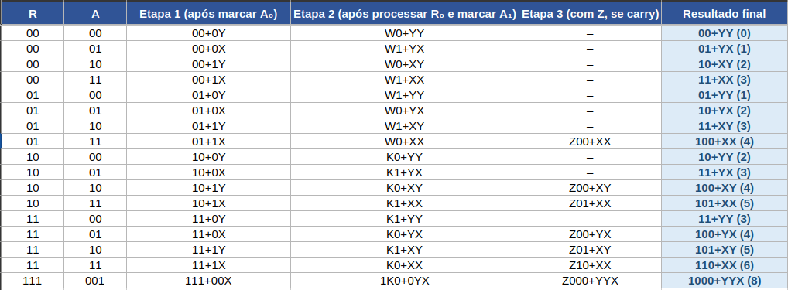
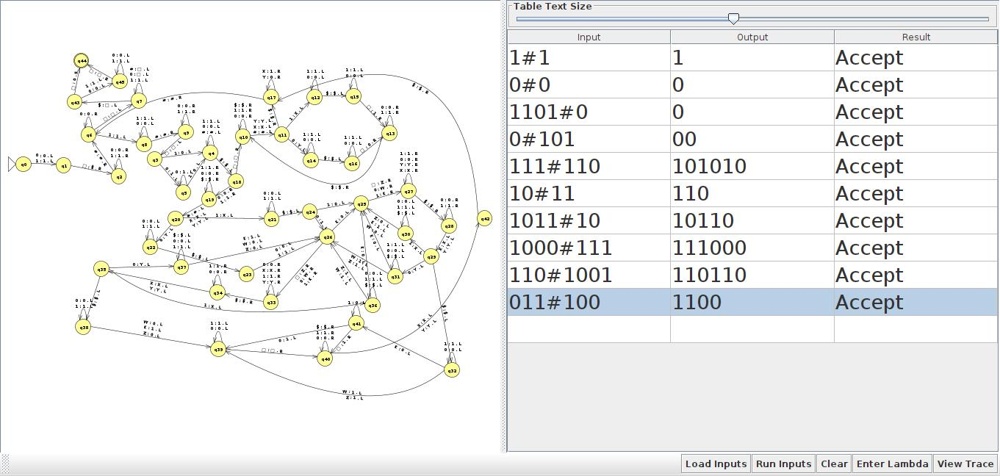

# Máquina de Turing - Multiplicação de Binário
Máquina de Turing no JFLAP que multiplica dois números binários por soma sucessiva.

---

## Descrição

Este projeto implementa uma Máquina de Turing capaz de realizar a multiplicação de dois números binários utilizando o método de soma sucessiva.

A máquina foi desenvolvida na ferramenta JFLAP como atividade da disciplina de Linguagens Formais e Autômatos.

---

## Legenda dos Símbolos

| Símbolo | Significado |
|---------|-------------|
| **A** | Vai ser somado sucessivamente (por ele mesmo) |
| **B** | Vai realizar a contagem das somas |
| **#** | Separa A de B |
| **$** | Separa A e B do resultado |
| **R** | Representa o resultado |
| **X** | Representa 1 em A |
| **Y** | Representa 0 em A |
| **K** | Representa 1 em R |
| **W** | Representa 0 em R |
| **Z** | Representa vazio em R |

---

## Explicação

A máquina recebe dois números binários separados por um símbolo delimitador (A#B).
Após o input:

1. Lê o primeiro bit de **A** e vai a esquerda para o vazio, onde insere o símbolo **$**;
   > **OBS.:** O binário sempre cresce da direita para a esquerda, por isso foi decidido inserir o resultado à esquerda do cálculo.

2. Na leitura de **B**, verifica se é composto apenas de zeros. Caso seja, vai em direção ao estado final. Se não, percorre **B** normalmente;

3. Decrementa **B**;

4. Vai até a esquerda de **$**. Se encontrar o vazio nenhum bit foi inserido, segue pelo caminho que transfere os bits de **A** para o vazio, utilizando **X** e **Y** para marcar os bits de **A** já transferidos. Após, **A** é transformado novamente em bits para a próxima verificação;

5. Passa pelos pontos 2 e 3 novamente;

6. Vai até a esquerda de **$**. Se encontrar um bit, então **A** já foi inserido e segue pelo caminho da soma;

7. Na soma, lê um bit de **A**, marca com **X** ou **Y** e segue até encontrar o bit de **R** e reproduz as propriedades somatórias de binários
(explicado no tópico "[Como funciona uma soma de binários](#como-funciona-uma-soma-de-binários)"). Após, vai uma casa à esquerda para ler o bit seguinte ao somado e marcar com **K**, **W** ou **Z**
para identificar qual será o próximo bit a ser somado e possíveis carrys (exemplos mostrados na tabela de caminhos de soma no tópico "[Testes e Validação](#testes-e-validação)");
   > **OBS.:** **A** e **R** são lidos da direita para a esquerda, ou seja, do último bit para o primeiro.

8. O processo de soma continua até **A** estar completo de **X** e **Y**, e vai resetar **A** aos bits novamente, dando continuidade aos processos 2,3,5,6 e 7 quantas vezes necessário;

9. Chegando **B** em zero, segue ao caminho do final e verifica se antes de **$** já possui algum valor. Caso possua, tudo é transformado em vazio,
exibindo apenas **R**. Caso **R** esteja vazio, é interpretado que desde o input **B** já era zero, assim transforma tudo em vazio e insere zero.

---

## Como funciona uma soma de binários

A soma de números binários segue regras semelhantes às da soma decimal, mas com apenas dois dígitos possíveis: 0 e 1.
As combinações básicas são:

```
0 + 0 = 0
0 + 1 = 1
1 + 0 = 1
1 + 1 = 10 (resultado 0, e "vai um" para a próxima posição)
```

Quando ocorre 1 + 1, o resultado é 0 e um carry (vai-um) é gerado para a posição seguinte. Se houver um carry da posição anterior, ele também deve ser somado:

```
1 + 1 + 1 = 11 (resultado 1, e carry 1 para a próxima posição)
```

```
━━━━━━━━━━━━  Exemplo Prático  ━━━━━━━━━━━━━

     ¹ ¹
     1 0 1
   + 0 1 1
   --------
   1 0 0 0

Passo a passo (da direita para a esquerda):

1. 1 + 1 = 0, carry (1)
2. 0 + 1 + carry = 0, carry 1
3. 1 + 0 + carry = 0, carry 1
4. Carry final 1 é adicionado à esquerda
━━━━━━━━━━━━━━━━━━━━━━━━━━━━━━━━━━━━━━━━━━━━
```

Na máquina, esse processo é feito por um conjunto de estados que:

- Somam bit a bit, da direita para a esquerda;
- Armazenam o carry no próprio fluxo de estados;
- Expandem o número quando o carry final é 1.

---

## Testes e Validação

**━━━━━━━━━━━━━━━━ Tabela de Caminhos da Soma ━━━━━━━━━━━━━━━━━━━**

A tabela abaixo mostra todos os caminhos possíveis da soma para operandos de 2 bits, além de um exemplo com 3 bits onde ocorre o carry extra (Z):



**━━━━━━━━━━━━━━━━━━━ Testes no JFLAP ━━━━━━━━━━━━━━━━━━━━━━━━━**

A máquina foi testada com diferentes entradas para validar seu funcionamento:



---

## Arquivo JFLAP

O arquivo da máquina pode ser baixado aqui:

[Download da Máquina de Turing](https://github.com/rannasilva/Maquina-de-Turing-multiplicacao-de-binario/raw/main/multipicacaobinario.jff)
